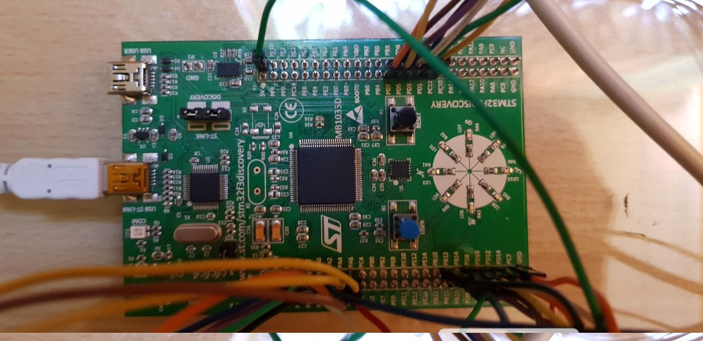
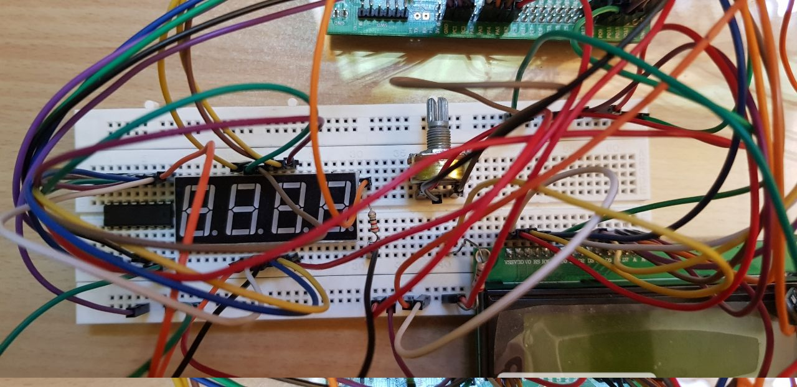

# Othello
 

Othello is a board game (also known as <i>Reversi</i>) for two players, played on an 8×8 uncheckered board. This project is an implementation of this game to play on an ARM-STM32 F3Discovery microcontroller. 

Also, there is a GUI implementation for this game, which can be used by connecting the microcontroller to a PC using a UART cable to show the real-time actions on the GUI.
 
 
 
The gif below shows the actual implementation of the program and the GUI: 
 
 

